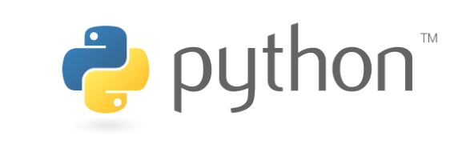
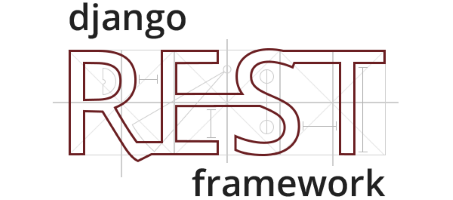
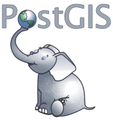
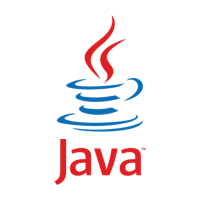
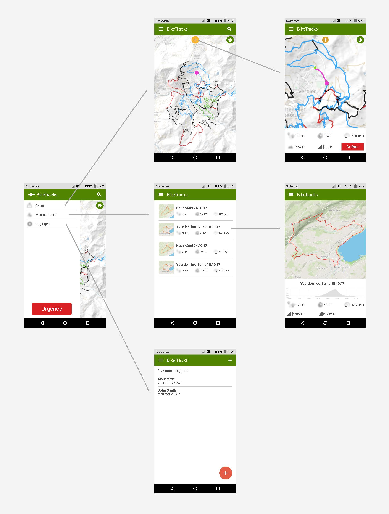

# Android project : BikeTracks

*October 2017 - January 2018*

Authors
- Antoine Drabble <antoine.drabble@master.hes-so.ch>
- Damien Rochat <damien.rochat@master.hes-so.ch>
- Sébastien Richoz <sebastien.richoz@master.hes-so.ch>

## Introduction

### Goal
The goal of this project is to develop an Android mobile application. The project is developped in Java and is called "BikeTracks"

This application let users discover mountain bike tracks by exploring them on a map and gives the following details on each track : the track itself drawn on the map, the altimetry profile and distance.

In addition, they would also be able to start their own mountain bike activity, tracked by the location of their smartphone letting them know if they are followoing or not the desired track. Typical data is also exposed like distance, time, current elevation, cumulate elevation and so on.

If the biker has any problem, an emergency call button will let him send his location to his predefined secure contacts.

All tracks are locally registered in the smartphone and users are able to consult them any time. They also may be shared with users' contacts (by email or another messaging app).

### Context

This project was realised by Damien Rochat, Sébastien Richoz et Antoine Drabble as part of the "Mobile operating systems and applications" courses at the MSE, HES-SO. It is supervised by the professor Pascal Bruegger. It was realised between october 2017 and january 2018.

### Code management and conventions

All of the code was developed and versionned using Github on the following repository: https://github.com/damienrochat/BikeTracks. 
We have followed the course recommendations on Android. We followed the coding style conventions of the Django Framework for the REST API https://docs.djangoproject.com/en/dev/internals/contributing/writing-code/coding-style/.

### Development phases

The development of the application was split in 6 phases.

1. Determination of the functionnalities
2. Creation of a mock-up of the application
3. Set up of the application and its dependencies
4. Creation of the activites layouts and creation of the backend in parallel
5. Development of the functionnalities on the Android application
6. Beta tests and bug fixes

The documentation was written along all of these phases.

## Functionalities

Here is the list of functionnalities that have been realised in this project.

- Show the bike tracks on a map in a radius R around a point P (the location is defined py the cyclist).
- Creation of a REST API for the retrieval of tracks
- Recording of an activity. The position of the cyclist if shown in real time on the map as well as the available tracks so that he can follow one. The cyclist can also save an activity where the is no track.
- Display of the historic of activities recorded by the cyclist.
- Detail on an activity. Visualisation of the track on a map with statistics such as duration, distance, average speed, altimetric profile, ...
- Sending of a manual SMS alert in case of an accident. The cyclist triggers the alert by clicking on a button and the alert is sent to the list of close people he has set along with his current position.

## Similar applications

There are many similar application available on Android:

- Runtastic Road Bike Cyclisme
- Cyclisme
- MapMyRide
- Komoot
- Strava
- TrailForks
- ViewRanger
- Bike routes
- Bikemap

Some of these application support recording and visualising your own tracks. Some others let users research for tracks on a map. But few allow both functionnalities.

Some of these applications also require payment to gain access to all the functionalities and most of them lack many tracks in Switzerland.

## Realisation

### Backend

#### Goal

The backend is a REST API which serves tracks over HTTP. It uses the Django REST Framework to process HTTP requests and a PostGIS database to store and query the tracks using spatial information.

#### Technologies

##### Python

Python is a popular interpreted programming language.



##### Django

Django is a big web Framework in Python.


##### Django REST Framework

Django REST framework is a powerful and flexible toolkit for building Web APIs in Python.



##### PostGIS

PostGIS provides spatial objects for the PostgreSQL database, allowing storage and query of information about location and mapping.



#### Database structure organisation of the classes

Here is the database UML (or not).

#### API Endpoints

The API contains a simple endpoint to retrieve the tracks in a given region defined by a circle:
- Center [lat,long] : The GPS coordinates corresponding to the center of the currently seen map on the smartphone
- Radius [m] : The biggest distance between the width and height of the currently seen map on the smartphone

More information about the API : https://github.com/damienrochat/BikeTracks-API

#### Track file format

The tracks are sent to the API in their .gpx format. Here is an example.

```xml
<?xml version="1.0" encoding="UTF-8"?>
<gpx xmlns="http://www.topografix.com/GPX/1/1" version="1.1" creator="Creator_name">
  <trk>
    <name>Name_of_the_track</name>
    <type>Downhill|Freeride|Enduro|Xcountry</type>
    <trkseg>
      <trkpt lat="46.78888733" lon="6.74366133">
        <ele>449.0</ele>
        <time>2017-09-22T10:11:35.000Z</time>
      </trkpt>
      ...
    </trkseg>
  </trk>
</gpx>
```

Then the API transforms it and stores in a postGIS database.

The API will return the tracks in a JSON format.

TODO schema architecture

#### Security

#### Tests

### Frontend

#### Goal

The frontend is the Android Application given to the clients. It handles all the requests of the users and communicates with the REST API to retrieve the tracks.

#### Technologies

##### Java

Java is a general-purpose computer programming language that is concurrent, class-based, object-oriented, and specifically designed to have as few implementation dependencies as possible. It is intended to let application developers "write once, run anywhere" (WORA), meaning that compiled Java code can run on all platforms without the need of recompilation.



##### Android

Android is a mobile operating system developed by Google, based on the Linux kernel and designed primarily for touchscreen mobile devices such as smartphones and tablets. In addition, Google has further developed Android TV for televisions, Android Auto for cars, and Android Wear for wrist watches, each with a specialized user interface. Variants of Android are also used on game consoles, digital cameras, PCs and other electronics.


##### Google Maps API

Google Maps is a web mapping service developped by Google. It provides a very useful API for Android which can be used to display and customize maps, search for locations, display markers and lines, ...


##### SQLite

SQLite is an in-process library that implements a self-contained, serverless, zero-configuration, transactional SQL database engine. The code for SQLite is in the public domain and is thus free for use for any purpose, commercial or private.


##### GraphView

GraphView is an open source graph plotting library for Android to programmatically create diagrams. It can be used to create Line Graphs, Bar Graphs, Point Graphs, ...


#### Design of the application

We have realised mock-ups of the application:



#### Structure of the code

Resources and classes

#### Navigation

#### Models and database

#### Deployment on the Play Store

#### Beta tests

## Difficulties encountered

### Reloading of a fragment (Google Map) with a Drawer

We have used a Drawer to access to the different fragments. It is not possible not to reload a fragment with the SupportFragmentManager. There is a method called addToBackstack but it uses a LIFO which is not what we need to access the different fragments. This is problematic because we have to reload the Google Maps map, position it at the last checked location and load all the tracks in it, each time the users access the fragment.

### GraphView doesn't support x and y axis labels

The library GraphView that we used for the graphs doesn't support x and y axis labels so we had to make it ourself with a custom layout. The y axis label must be vertical and Android doesn't support that by default so we had to find a custom vertical TextView named VerticalTextView to display the label correctly.

## Remaining bugs

## Possible improvements

Here is a list of improvements we would have liked to add to the application:

- Show the forecast weather of the selected track as well as a heatmap and the precipitations.

- Let the user choose between different layers of map with a better altitude representation for example. We have used the Google Maps API but we would also like to try using OpenStreetMap which allows different configurations of the maps.

- Let the user download the GPX files so that he can use them in other applications.

- Make a Smartwatch version

- Let the user send tracks to the API so that we could maybe add them to the lists of public tracks.

- Let the user store his tracks in an online database so that he can load them on another device.

- Lower the quantity of points on some of the tracks to limit the network charge for the user and diminish the response times.

## Conclusion

This project was very interesting, manipulating the Google Maps API to display our own tracks was motivating...

## Bibliography

## Annex

### Installation manual

### User guide

### REST API documentation

### Javadoc

### Source code
